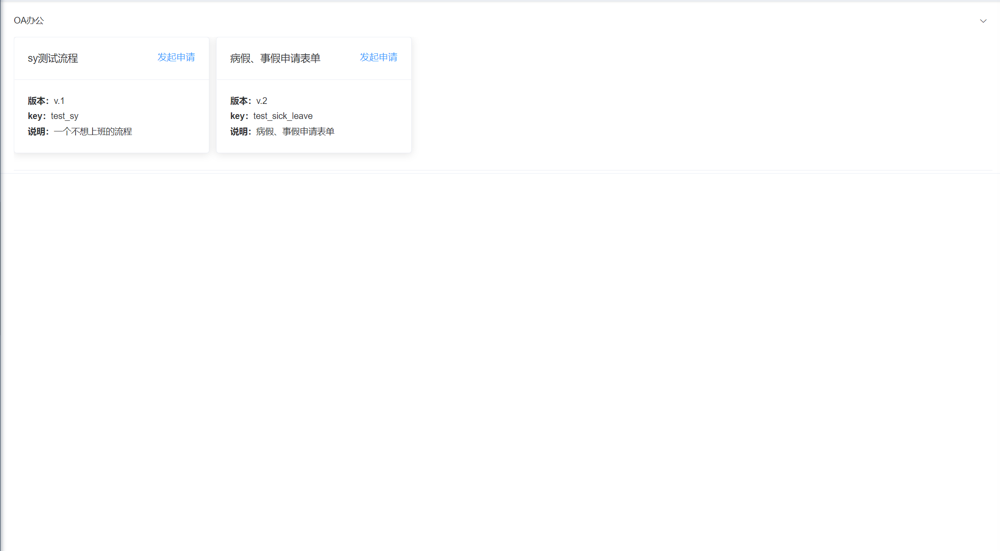
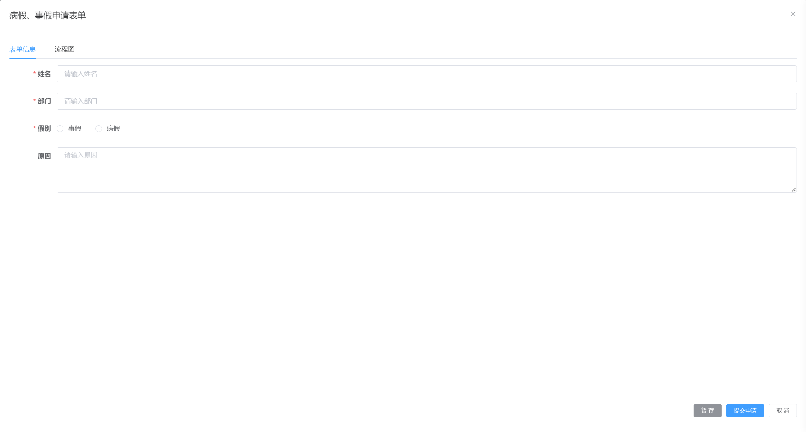

# 表单设计  

## 一. 组件名称

* CubeInitiateApplication  

## 二. 功能示例 

### 1. 发起申请列表
  

### 2. 发起申请
  

## 三. 组件使用代码示例
```js
<CubeInitiateApplication
  @listDefinitionCall="onListDefinition"
  @queryFormByDeploymentIdCall="onQueryFormDesignByDeploymentId"
  @tempSaveCall="onTempSave"
  @submitApplyCall="onSubmitApply"
  @getFirstApprovalNodeCall="onGetFirstApprovalNode">
</CubeInitiateApplication>
```  
  
## 四. 组件方法  


| 方法名称               | 说明                    | 参数                |  返回数据
| ----------------------| ------------------------| ---------------------------------- |---------------------------|
| @listDefinitionCall   | 发起申请列表回调函数      |  queryParams  |  {"total":4,"rows":[],"code":200,"msg":"查询成功"}  |
| @queryFormByDeploymentIdCall | 根据模型部署id获取申请流程业务对象信息回调函数  | deploymentId   | {"msg":"操作成功","code":200,"data":{}} |
| @tempSaveCall       | 暂存流程申请回调函数        | formObject     | {"msg":"操作成功","code":200,"data":{}} |
| @submitApplyCall    | 提交流程申请回调函数        | formObject   |  {"msg":"操作成功","code":200,"data":{}} |
| @getFirstApprovalNodeCall | 获取第一个审批节点回调函数       | deploymentId   |  {"msg":"操作成功","code":200,"data":{}} |

## 五. 方法函数代码示例  

### 发起申请列表
```js
// 实现发起申请列表回调函数的前端调用接口
onListDefinition: (queryParams, callback) => {
  // 根据参数ajax请求
  request({
    url: '/flowable/applay/list',
    method: 'get',
    params: queryParams
  }).then(response => {
    console.log(response)
    callback(response)
  })
}
```
```java
// 后台controller
/**
  * 获取发起申请列表
  * @param processDefinition
  * @return
  */
@GetMapping("/list")
public TableDataInfo list(CubeProcessDefinition processDefinition) {
    // 调用工作流引擎的cubeInitiateApplicationService.initiateApplicationList方法发起申请列表
    List<CubeProcessDefinition> list = cubeInitiateApplicationService.initiateApplicationList(processDefinition);
    return getDataTable(list);
}
```

### 根据模型部署id获取申请流程业务对象信息
```js
// 实现根据模型部署id获取申请流程业务对象信息的前端调用接口
onQueryFormDesignByDeploymentId: (deploymentId, callback) => {
  // 根据参数ajax请求
  request({
    url: '/flowable/applay/queryFormByDeploymentId',
    method: 'get',
    params: {'deploymentId': deploymentId}
  }).then(response => {
    callback(response.data)
  })
}
```
```java
// 后台controller
/**
  * 根据部署模型id查找表单结构并渲染
  * @param deploymentId
  * @return
  */
@GetMapping("/queryFormByDeploymentId")
public AjaxResult queryFormByDeploymentId(String deploymentId) {
    // 调用工作流引擎的cubeInitiateApplicationService.queryFormByDeploymentId方法查找表单结构
    return AjaxResult.success(cubeInitiateApplicationService.queryFormByDeploymentId(deploymentId));
}
```

### 暂存流程申请
```js
// 实现暂存流程申请回调函数的前端调用接口
onTempSave: (formObject, callback) => {
  request({
    url: '/flowable/applay/tempSave',
    method: 'post',
    data: formObject
  }).then(response => {
    callback(response.data)
  })
}
```
```java
// 后台controller
/**
  * 暂存表单
  * @param applayFormDto
  * @return
  */
@PostMapping("/tempSave")
public AjaxResult tempSave(@RequestBody ApplayFormDto applayFormDto) {
    try {
        // 获取业务系统当前登陆人并传给流程引擎
        LoginUser loginUser = getLoginUser();
        CurrentUser user = new CurrentUser();
        user.setId(loginUser.getUserId());
        user.setUserName(loginUser.getUsername());
        user.setNickName(loginUser.getUser().getNickName());
        applayFormDto.setCurrentUser(user);
        // 调用工作流引擎的cubeInitiateApplicationService.tempSave方法暂存表单
        cubeInitiateApplicationService.tempSave(applayFormDto);
    } catch (Exception e) {
        e.printStackTrace();
        return AjaxResult.error("暂存表单报错");
    }
    return AjaxResult.success();
}
```

### 提交流程申请
```js
// 实现提交流程申请回调函数的前端调用接口
onSubmitApply: (formObject, callback) => {
  request({
    url: '/flowable/process/submitApply',
    method: 'post',
    data: formObject
  }).then(response => {
    callback(response.data)
  })
}
```
```java
// 后台controller
/**
  * 提交申请流程操作
  * @param applayFormDto
  * @return
  */
@PostMapping("/submitApply")
public AjaxResult submitApply(@RequestBody ApplayFormDto applayFormDto) {
    try {
        // 获取业务系统当前登陆人并传给流程引擎
        LoginUser loginUser = getLoginUser();
        CurrentUser user = new CurrentUser();
        user.setId(loginUser.getUserId());
        user.setUserName(loginUser.getUsername());
        user.setNickName(loginUser.getUser().getNickName());
        applayFormDto.setCurrentUser(user);
        // 调用工作流引擎的cubeProcessService.submitApply方法提交流程申请
        cubeProcessService.submitApply(applayFormDto);
    } catch (Exception e) {
        e.printStackTrace();
        return AjaxResult.error("提交申请报错");
    }
    return AjaxResult.success();
}
```

### 获取第一个审批节点
```js
// 实现获取第一个审批节点回调函数的前端调用接口
onGetFirstApprovalNode: (nodeTask, callback) => {
  request({
    url: '/flowable/process/getFirstApprovalNode',
    method: 'get',
    params: nodeTask
  }).then(response => {
    callback(response.data)
  })
}
```
```java
// 后台controller
/**
  * 获取第一个审批节点信息
  * @param nodeTaskDto
  * @return
  */
@GetMapping("/getFirstApprovalNode")
public AjaxResult getFirstApprovalNode(NodeTaskDto nodeTaskDto) {
    // 调用工作流引擎的cubeProcessService.getFirstApprovalNode方法获取第一个审批节点信息
    return AjaxResult.success(cubeProcessService.getFirstApprovalNode(nodeTaskDto));
}
```

## 六. 完整调用代码示例  
### 前端vue页面代码
```js
<template>
  <CubeInitiateApplication
    @listDefinitionCall="onListDefinition"
    @queryFormByDeploymentIdCall="onQueryFormDesignByDeploymentId"
    @tempSaveCall="onTempSave"
    @submitApplyCall="onSubmitApply"
    @getFirstApprovalNodeCall="onGetFirstApprovalNode">
  </CubeInitiateApplication>
</template>

<script>

import request from '@/utils/request'

export default {
  data() {
    return {

    }
  },
  methods: {
    onListDefinition: (queryParams, callback) => {
      // 根据参数ajax请求
      request({
        url: '/flowable/applay/list',
        method: 'get',
        params: queryParams
      }).then(response => {
        callback(response)
      })

    },
    onQueryFormDesignByDeploymentId: (deploymentId, callback) => {
      // 根据参数ajax请求
      request({
        url: '/flowable/applay/queryFormByDeploymentId',
        method: 'get',
        params: {'deploymentId': deploymentId}
      }).then(response => {
        callback(response.data)
      })

    },
    // 暂存
    onTempSave: (formObject, callback) => {
      request({
        url: '/flowable/applay/tempSave',
        method: 'post',
        data: formObject
      }).then(response => {
        callback(response.data)
      })
    },
    // 提交申请
    onSubmitApply: (formObject, callback) => {
      request({
        url: '/flowable/process/submitApply',
        method: 'post',
        data: formObject
      }).then(response => {
        callback(response.data)
      })
    },
    // 根据部署模型id获取第一个审批节点信息
    onGetFirstApprovalNode: (deploymentId, callback) => {
      request({
        url: '/flowable/process/getFirstApprovalNode',
        method: 'get',
        params: {'deploymentId': deploymentId}
      }).then(response => {
        callback(response.data)
      })
    }
  }
}
</script>

<style>

</style>
```
### 后端java代码
```java
package com.ruoyi.web.controller.flowable;

import com.liujianan.cube.flowable.common.core.web.domain.CurrentUser;
import com.liujianan.cube.flowable.entity.CubeProcessDefinition;
import com.liujianan.cube.flowable.entity.dto.ApplayFormDto;
import com.liujianan.cube.flowable.service.CubeInitiateApplicationService;
import com.ruoyi.common.core.controller.BaseController;
import com.ruoyi.common.core.domain.AjaxResult;
import com.ruoyi.common.core.domain.model.LoginUser;
import com.ruoyi.common.core.page.TableDataInfo;
import org.springframework.beans.factory.annotation.Autowired;
import org.springframework.web.bind.annotation.GetMapping;
import org.springframework.web.bind.annotation.PostMapping;
import org.springframework.web.bind.annotation.RequestBody;
import org.springframework.web.bind.annotation.RequestMapping;
import org.springframework.web.bind.annotation.RestController;

import java.util.List;

/**
 * @version v1.0
 * @ProjectName: RuoYi-Vue
 * @ClassName: CubeInitiateApplicationController
 * @Description: 发起申请controller
 * @Author: 风清扬 [刘佳男]
 * @Date: 2022/11/23 13:03
 */

@RestController
@RequestMapping("/flowable/applay")
public class CubeInitiateApplicationController extends BaseController {

    @Autowired
    private CubeInitiateApplicationService cubeInitiateApplicationService;

    /**
     * 获取发起申请列表
     * @param processDefinition
     * @return
     */
    @GetMapping("/list")
    public TableDataInfo list(CubeProcessDefinition processDefinition) {
        List<CubeProcessDefinition> list = cubeInitiateApplicationService.initiateApplicationList(processDefinition);
        return getDataTable(list);
    }

    /**
     * 根据部署模型id查找表单结构并渲染
     * @param deploymentId
     * @return
     */
    @GetMapping("/queryFormByDeploymentId")
    public AjaxResult queryFormByDeploymentId(String deploymentId) {
        return AjaxResult.success(cubeInitiateApplicationService.queryFormByDeploymentId(deploymentId));
    }

    /**
     * 暂存表单
     * @param applayFormDto
     * @return
     */
    @PostMapping("/tempSave")
    public AjaxResult tempSave(@RequestBody ApplayFormDto applayFormDto) {
        try {
            // 获取业务系统当前登陆人并传给流程引擎
            LoginUser loginUser = getLoginUser();
            CurrentUser user = new CurrentUser();
            user.setId(loginUser.getUserId());
            user.setUserName(loginUser.getUsername());
            user.setNickName(loginUser.getUser().getNickName());
            applayFormDto.setCurrentUser(user);
            cubeInitiateApplicationService.tempSave(applayFormDto);
        } catch (Exception e) {
            e.printStackTrace();
            return AjaxResult.error("暂存表单报错");
        }
        return AjaxResult.success();
    }

    /**
     * 获取表单数据
     * @return
     */
    @GetMapping("/getBusinessFormData")
    public AjaxResult getBusinessFormData(String businessKey, String tableCode) {
        return AjaxResult.success(cubeInitiateApplicationService.getBusinessFormData(businessKey, tableCode));
    }

}


```