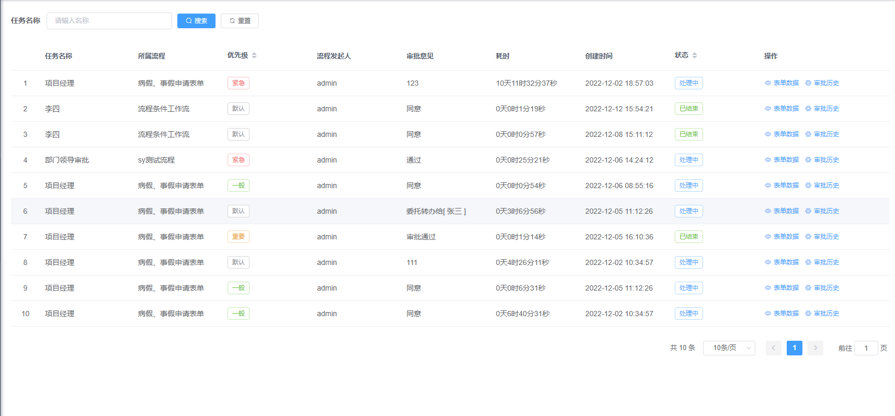

# 流程定义

## 一. 组件名称

- CubeDoneList

## 二. 功能示例

### 1. 我的已办列表：



### 2. 实时流程图：


### 3. 审批记录：


## 三. 组件使用代码示例

```js
<CubeDoneList
  @getDoneListCall="onGetDoneList"
  @getFormDataCall="onGetFormData"
  @getProcessDiagramCall="onGetProcessDiagram"
  @getApprovalHistoryCall="onGetApprovalHistory"
></CubeDoneList>
```

### 四、 组件方法

| 方法名称              | 实现函数              | 说明                  | 请求参数                  | 返回数据                  |
| ---------------------| --------------------| -------------------------| -------------------- |---------------------------|
| getDoneListCall     | onGetDoneList        | 获取已办列表    | {taskName: 任务名称,pageNum: 分页页数,pageSize: 分页大小}   | { "total":总数量, "rows":返回的数据, "code":状态码, "msg":返回的信息 }  |
| getFormDataCall     | onGetFormData       | 获取表单数据  | {businessKey: 业务key,tableCode: 表编码,}   | { "msg": 返回的信息, "code":状态码，data:数据 }     |
| getProcessDiagramCall     | onGetProcessDiagram       | 获取流程图     | {processInstanceId : 流程实例id}  | { "msg": 返回的信息, "code":状态码，data:数据 }   |
| getApprovalHistoryCall     | onGetApprovalHistory        | 获取审批历史    | {processInstanceId : 流程实例id} | { "msg": 返回的信息, "code":状态码，data:数据 }   |


## 五. 方法函数代码示例

### * 获取我的已办列表

```js
// 前端调用接口
onGetDoneList: (params,callback) => {
  request({
    url: "/flowable/process/doneList"+ "?pageNum=" + params.pageNum + '&pageSize=' + params.pageSize,
    method: "post",
    data: params,
  }).then((response) => {
    callback(response);
  });
},
```

```java
// 后台示例：获取流程定义列表
@PostMapping("/doneList")
public TableDataInfo doneList(@RequestBody CubeTask cubeTask) {
  startPage();
  // 获取业务系统当前登陆人并传给流程引擎
  LoginUser loginUser = getLoginUser();
  CurrentUser user = new CurrentUser();
  user.setId(loginUser.getUserId());
  user.setUserName(loginUser.getUsername());
  cubeTask.setCurrentUser(user);
  List<CubeTask> list = cubeProcessService.myDoneList(cubeTask);
  return getDataTable(list);
}
```
### * 获取表单数据
```js
// 前端调用接口示例
onGetFormData: (params, callback) => {
  request({
    url: '/flowable/applay/getBusinessFormData',
    method: 'get',
    params: params
  }).then(response =>{
    callback(response)
  })
},
```

```java
// 后台示例
@GetMapping("/getBusinessFormData")
public AjaxResult getBusinessFormData(String businessKey, String tableCode) {
    return AjaxResult.success(cubeInitiateApplicationService.getBusinessFormData(businessKey, tableCode));
}
```
### * 获取流程图
```js
// 前端调用接口示例
onGetProcessDiagram : (params,callback) => {
  request({
    url: "/flowable/process/processDiagram",
    method: "post",
    data: params,
  }).then((response) => {
    callback(response);
  });
},
```

```java
// 后台示例
@PostMapping("/processDiagram")
public AjaxResult getProcessDiagram(@RequestBody Map<String,String> params) {
  Map map = cubeProcessService.getProcessDiagram(params.get("processInstanceId"));
  return AjaxResult.success(map);
}
```
### * 获取审批历史
```js
// 前端调用接口示例
getApprovalHistoryCall: (params, callback) => {
  request({
    url: "/process/definition/getXml",
    method: "post",
    data: params,
  }).then((response) => {
    callback(response);
  });
},
```

```java
// 后台示例
@PostMapping("/listHistory")
public TableDataInfo listHistory(@RequestBody HistoricActivity historicActivity) {
    List<HistoricActivity> list = cubeProcessService.selectHistoryList(historicActivity);
    return getDataTable(list);
}
```