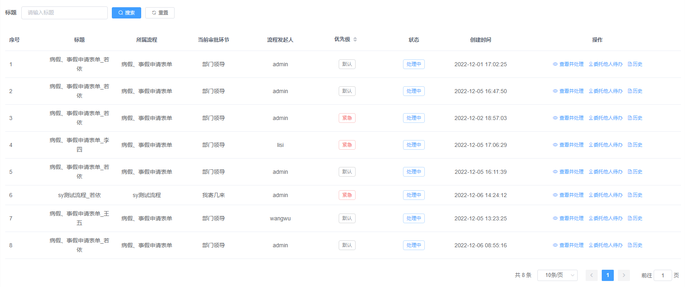
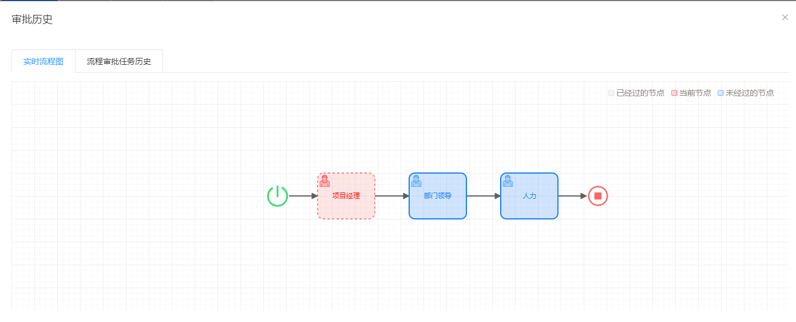
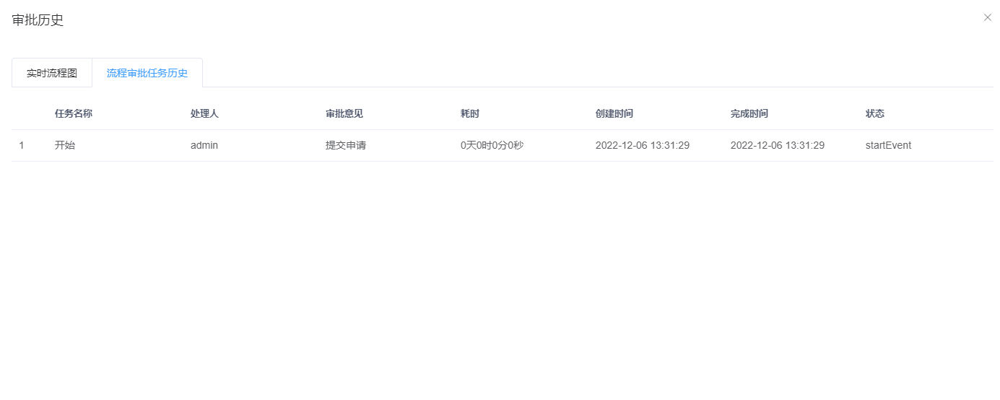

# 待办列表

## 一. 组件名称

- CubeToDoList

## 二. 功能示例

### 1. 我的待办列表：



### 2. 实时流程图：



### 3. 审批记录：



## 三. 组件使用代码示例
```js
<cube-to-do-list
  @getToDoListCall="onGetTodoList"
  @getProcessDiagramCall="onGetProcessDiagram"
  @getApprovalHistoryCall="onGetApprovalHistory"
  @getTreeCall="onGetTreeList"
  @getUserCall="onGetUserList"
  @getFormDataCall="onGetForm"
  @rejectCall="onRejectForm"
  @passCall="onCompleteForm"
  @entrustCall="onEntrustOthersForm"
  @getNextApprovalNodeCall="onGetNextApprovalNode"
></cube-to-do-list>

```

### 组件方法

| 方法名称              | 实现函数              | 说明                  | 参数                  | 返回数据                  |
| ---------------------| --------------------| ----------------------| -------------------- |---------------------------|
| getToDoListCall     | onGetTodoList        | 查询待办列表        | {title: 标题,pageNum: 分页页数,pageSize: 分页大小}   | { { "total":总数量, "rows":返回的数据, "code":状态码, "msg":返回的信息 } }     |
| getProcessDiagramCall     | onGetProcessDiagram       | 获取流程图     | {processInstanceId : 流程实例id}  | { "msg": 返回的信息, "code":状态码，data:数据 }   |
| getApprovalHistoryCall     | onGetApprovalHistory        | 获取审批历史    | {processInstanceId : 流程实例id} | { "msg": 返回的信息, "code":状态码，data:数据 }   |
| getDeptTreeCall     | onGetDeptTree      | 获取部门树       | 无    | { "msg":返回的信息, "code":状态码, "data":返回的数据 }     |
| getUserListCall     | onGetUserList       | 获取用户列表       |  {userName: 用户名,pageNum: 分页页数,pageSize: 分页大小,deptId:部门id} |  { "total":总数量, "rows":返回的数据, "code":状态码, "msg":返回的信息 }  |
| getFormDataCall     | onGetForm      | 获取表单数据和驳回选项        | {businessKey: 业务key,tableCode: 表编码,taskId:任务id}   | { "msg": "返回的信息", "code":状态码，"data":{数据} }     |
| rejectCall     | onRejectForm      | 驳回操作        | backNodeDto  | { "msg":"返回的信息", "code":状态码, "data":{数据} }   |
| passCall     | onCompleteForm      | 完成操作       | formObject    | { "msg":"返回的信息", "code":状态码, "data":{数据} }     |
| entrustCall     | onEntrustOthersForm       | 委托他人待办       | delegateDto  |   { "msg":"返回的信息", "code":状态码, "data":{数据} }     |
| getNextApprovalNodeCall     | onGetNextApprovalNode       | 获取下一个审批节点       | {instanceId: 实例Id}  |   { "msg":"返回的信息", "code":状态码, "data":{数据} }     |


## 五. 方法函数代码示例

### * 获取我的待办列表

```js
//前端调用接口   
onGetTodoList: (queryParams, callback) => {
  request({
    url: '/flowable/process/todoList',
    method: 'get',
    params: queryParams
  }).then(response => {
    callback(response)
  });
},
```

```java
// 后台示例：获取我的待办列表
@GetMapping("/todoList")
public TableDataInfo taskList(CubeTask cubeTask) {
  startPage();
  // 获取业务系统当前登陆人并传给流程引擎
  LoginUser loginUser = getLoginUser();
  CurrentUser user = new CurrentUser();
  user.setId(loginUser.getUserId());
  user.setUserName(loginUser.getUsername());
  cubeTask.setCurrentUser(user);
  List<CubeTask> list = cubeProcessService.myTodoList(cubeTask);
  return getDataTable(list);
}
```

### * 获取流程图

```js
// 前端调用接口示例
onGetProcessDiagram : (params,callback) => {
  request({
    url: "/flowable/process/processDiagram",
    method: "post",
    data: params,
  }).then((response) => {
    callback(response);
  });
},
```

```java
// 后台示例
@PostMapping("/processDiagram")
public AjaxResult getProcessDiagram(@RequestBody Map<String,String> params) {
  Map map = cubeProcessService.getProcessDiagram(params.get("processInstanceId"));
  return AjaxResult.success(map);
}
```

### * 获取审批历史

```js
// 前端调用接口示例
getApprovalHistoryCall: (params, callback) => {
  request({
    url: "/process/definition/getXml",
    method: "post",
    data: params,
  }).then((response) => {
    callback(response);
  });
},
```

```java
// 后台示例
@PostMapping("/listHistory")
public TableDataInfo listHistory(@RequestBody HistoricActivity historicActivity) {
    List<HistoricActivity> list = cubeProcessService.selectHistoryList(historicActivity);
    return getDataTable(list);
}
```

### *  获取部门树

```js
// 前端调用接口示例
onGetDeptTree: (callback) => {
  request({
    url: "/deptTree",
    method: "post",
  }).then((response) => {
    callback(response.data);
  });
},
```

```java
// 后台示例
@PostMapping("/deptTree")
public AjaxResult getDeptTree(){
    return AjaxResult.success(cubeDeptService.selectDeptTree());
}
```
### * 获取用户列表

```js
// 前端调用接口示例
onGetUserList: (params, callback) => {
  request({
    url: "/list/user",
    method: "post",
    data: params,
  }).then((response) => {
    callback(response);
  });
},
```

```java
// 后台示例
@PostMapping("/list/user")
public TableDataInfo getUserList(@RequestBody Map<String,String> params){
  startPage();
  List<CubeUser> list = cubeUserService.selectUserList(params.get("userName"),params.get("deptId"));
  return getDataTable(list);
}
```
### * 获取表单数据和驳回选项

```js
// 前端调用接口示例
onGetForm: (queryParams, callback) => {
  request({
    url: '/flowable/process/formData',
    method: 'get',
    params: queryParams
  }).then(response => {
    callback(response.data)
  })
},
```

```java
// 后台示例
@GetMapping("/formData")
public AjaxResult getFormBusinessAndRejectData(CubeTask cubeTask){
  Map<String, Object> map = cubeProcessService.getFormBusinessAndRejectData(cubeTask.getBusinessKey(), cubeTask.getTableCode(), cubeTask.getTaskId());
  return AjaxResult.success(map);
}
```

### * 办理操作

```js
// 前端调用接口示例
onCompleteForm: (formObject, callback) => {
  request({
    url: '/flowable/process/complete',
    method: 'post',
    data: formObject
  }).then(response => {
    callback(response.data)
  })
},
```

```java
//后台示例
@PostMapping("/complete")
public AjaxResult complete(@RequestBody CubeTask cubeTask){
    try{
        // 获取业务系统当前登陆人并传给流程引擎
        LoginUser loginUser = getLoginUser();
        CurrentUser user = new CurrentUser();
        user.setId(loginUser.getUserId());
        user.setUserName(loginUser.getUsername());
        user.setNickName(loginUser.getUser().getNickName());
        cubeTask.setCurrentUser(user);
        cubeProcessService.complete(cubeTask);
    } catch (Exception e) {
        e.printStackTrace();
        return AjaxResult.error("办理失败");
    }
    return AjaxResult.success();
}
```

### * 驳回操作

```js
// 前端调用接口示例
onRejectForm: (backNodeDto, callback) => {
  request({
    url: '/flowable/process/doBackNode',
    method: 'post',
    data: backNodeDto
  }).then(response => {
    callback(response.data)
  })
},
```

```java
// 后台示例
@PostMapping("/doBackNode")
public AjaxResult doBackNode(@RequestBody BackNodeDto backNodeDto){
    try{
        // 获取业务系统当前登陆人并传给流程引擎
        LoginUser loginUser = getLoginUser();
        CurrentUser user = new CurrentUser();
        user.setId(loginUser.getUserId());
        user.setUserName(loginUser.getUsername());
        user.setNickName(loginUser.getUser().getNickName());
        backNodeDto.setCurrentUser(user);
        cubeProcessService.doBackNode(backNodeDto);
    } catch (Exception e) {
        e.printStackTrace();
        return AjaxResult.error("驳回失败");
    }
    return AjaxResult.success();
}
```

### * 委托他人代办

```js
// 前端调用接口示例
onEntrustOthersForm: (delegateDto, callback) => {
  request({
    url: '/flowable/process/delegate',
    method: 'post',
    data: delegateDto
  }).then(response => {
    callback(response.data)
  })
},
```

```java
// 后台示例
@PostMapping("/delegate")
public AjaxResult delegate(@RequestBody DelegateDto delegateDto) {
    // 获取业务系统当前登陆人并传给流程引擎
    LoginUser loginUser = getLoginUser();
    CurrentUser user = new CurrentUser();
    user.setId(loginUser.getUserId());
    user.setUserName(loginUser.getUsername());
    user.setNickName(loginUser.getUser().getNickName());
    delegateDto.setCurrentUser(user);
    cubeProcessService.delegate(delegateDto);
    return AjaxResult.success();
}
```
### * 获取上一个节点信息

```js
// 前端调用接口示例
onGetNextApprovalNode: (instanceId, callback) => {
  request({
    url: '/flowable/process/getNextApprovalNode',
    method: 'get',
    params: {'instanceId': instanceId}
  }).then(response => {
    callback(response.data)
  })
},
```

```java
// 后台示例
@GetMapping("/getNextApprovalNode")
public AjaxResult getNextApprovalNode(String instanceId) {
    return AjaxResult.success(cubeProcessService.getNextApprovalNode(instanceId));
} 

```
