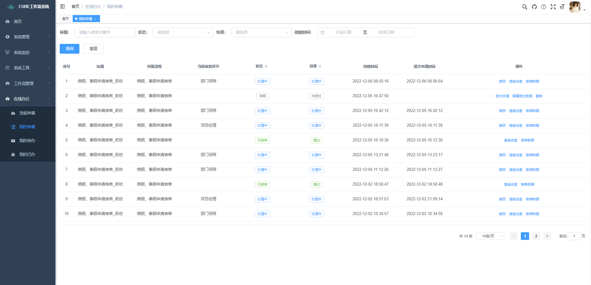

# 我的申请

## 一.组件名称

- CubeMyApplications

## 二.功能示例



## 三.组件使用代码示例

```javascript
<CubeMyApplications
    @getApplicationsListCall="onGetList"
    @submitApplicationCall="onSubmitApplication"
    @getApprovedByListCall="onGetApprovedByList"
    @modifyApplicationCall="onModifyApplication"
    @deleteApplicationCall="onDeleteApplication"
    @revokeApplicationCall="onRevokeApplication"
    @getProcessDiagramCall="onGetProcessDiagram"
    @getFormDataCall="onGetFormData"
    @getHistoryCall="onGetHistory"
></CubeMyApplications>
```

## 四.组件方法

| 方法名称                 | 实现函数            | 说明                                         | 参数              | 返回数据                                                     |
| ------------------------ | ------------------- | -------------------------------------------- | ----------------- | ------------------------------------------------------------ |
| getApplicationsListCall | onGetList           | 获取由我发起的流程和草稿                     | queryParams | {code:状态码,msg:返回信息,rows:返回数据,total:总数量} |
| submitApplicationCall   | onSubmitApplication | 提交草稿请求                                 | submitConfirmForm | {code:状态码,msg:返回信息} |
| getApprovedByListCall   | onGetApprovedByList | 获取审批人列表                               | nodeTask | {code:状态码,msg:返回信息,data:返回数据} |
| modifyApplicationCall   | onModifyApplication | 修改草稿数据                                 | modifyDataForm    | {code:状态码,msg:返回信息} |
| deleteApplicationCall   | onDeleteApplication | 删除草稿                                     | myApplicationId   | {code:状态码,msg:返回信息} |
| revokeApplicationCall   | onRevokeApplication | 撤回已提交的申请 | revokeForm        | {code:状态码,msg:返回信息} |
| getProcessDiagramCall   | onGetProcessDiagram | 获取审批历史记录流程图                       | processInstanceId | {code:状态码,msg:返回信息,data:流程图数据} |
| getFormDataCall         | onGetFormData       | 获取表单数据                                 | formDataDto       | {code:状态码,msg:返回信息,data:表单数据} |
| getHistoryCall          | onGetHistory        | 获取流程实例审批历史记录                     | historicActivity  | {code:状态码,msg:返回信息,rows:返回数据,total:总数量} |

## 五.方法函数代码示例

### * 查询我的申请列表

```javascript
// 前端调用接口
onGetList: (queryParams, callback) => {
    // 根据参数ajax请求
    request({
        url: '/flowable/process/getList',
        method: 'get',
        params: queryParams
    }).then(response =>{
        callback(response)
    })
},
```

```java
// 后台示例：
@GetMapping("/getList")
public TableDataInfo getList(CubeTask cubeTask){
    startPage();
    // 获取业务系统当前登陆人并传给流程引擎
    LoginUser loginUser = getLoginUser();
    CurrentUser user = new CurrentUser();
    user.setId(loginUser.getUserId());
    user.setUserName(loginUser.getUsername());
    user.setNickName(loginUser.getUser().getNickName());
    cubeTask.setCurrentUser(user);
    List<CubeTask> applicationList = cubeProcessService.myApplicationList(cubeTask);
    return getDataTable(applicationList);
}
```

### * 提交申请

```javascript
// 前端调用接口
onSubmitApplication: (submitConfirmForm, callback) =>{
    request({
        url: '/flowable/process/submitApply',
        method: 'post',
        data: submitConfirmForm
    }).then(response => {
        callback(response)
    })
},
```

```java
// 后台示例：
@PostMapping("/submitApply")
public AjaxResult submitApply(@RequestBody ApplayFormDto applayFormDto) {
    try {
        // 获取业务系统当前登陆人并传给流程引擎
        LoginUser loginUser = getLoginUser();
        CurrentUser user = new CurrentUser();
        user.setId(loginUser.getUserId());
        user.setUserName(loginUser.getUsername());
        user.setNickName(loginUser.getUser().getNickName());
        applayFormDto.setCurrentUser(user);
        cubeProcessService.submitApply(applayFormDto);
    } catch (Exception e) {
        e.printStackTrace();
        return AjaxResult.error("提交申请报错");
    }
    return AjaxResult.success();
}
```

### * 获取审批人列表

```javascript
// 前端调用接口
onGetApprovedByList: (nodeTask, callback) =>{
    request({
        url: "/flowable/process/getFirstApprovalNode",
        method: "get",
        params: nodeTask,
    }).then(response => {
        callback(response.data)
    })
},
```

```java
// 后台示例：
@GetMapping("/getFirstApprovalNode")
public AjaxResult getFirstApprovalNode(NodeTaskDto nodeTaskDto) {
	return AjaxResult.success(cubeProcessService.getFirstApprovalNode(nodeTaskDto));
}
```

### * 修改草稿数据

```javascript
// 前端调用接口
onModifyApplication: (modifyDataForm, callback) =>{
    request({
        url:'/flowable/applay/tempSave',
        method: 'post',
        data:modifyDataForm,
    }).then(response =>{
        callback(response)
    })
},
```

```java
// 后台示例：
@PostMapping("/tempSave")
public AjaxResult tempSave(@RequestBody ApplayFormDto applayFormDto) {
    try {
        // 获取业务系统当前登陆人并传给流程引擎
        LoginUser loginUser = getLoginUser();
        CurrentUser user = new CurrentUser();
        user.setId(loginUser.getUserId());
        user.setUserName(loginUser.getUsername());
        user.setNickName(loginUser.getUser().getNickName());
        applayFormDto.setCurrentUser(user);
        cubeInitiateApplicationService.tempSave(applayFormDto);
    } catch (Exception e) {
        e.printStackTrace();
        return AjaxResult.error("暂存表单报错");
    }
    return AjaxResult.success();
}
```

### * 删除申请

```javascript
// 前端调用接口
onDeleteApplication: (myApplicationId, callback) =>{
    request({
        url:'/flowable/process/deleteApplication',
        method: 'post',
        data: myApplicationId
    }).then(response =>{
        callback(response)
    })
},
```

```java
// 后台示例：
@PostMapping("/deleteApplication")
public AjaxResult deleteApplication(@RequestBody Long myApplicationId){
    try{
    	cubeProcessService.deleteMyApplication(myApplicationId);
    }catch (Exception e){
        e.printStackTrace();
        return AjaxResult.error();
    }
    return AjaxResult.success();
}
```

### * 撤回申请

```javascript
// 前端调用接口
onRevokeApplication: (revokeForm, callback) =>{
    // 根据参数ajax请求
    request({
        url: '/flowable/process/revokeProcess',
        method: 'post',
        data: revokeForm
    }).then(response => {
        callback(response.data)
    })
},
```

```java
// 后台示例：
@PostMapping("/revokeProcess")
public AjaxResult revokeProcess(@RequestBody CubeTask cubeTask){
    // 获取业务系统当前登陆人并传给流程引擎
    LoginUser loginUser = getLoginUser();
    CurrentUser user = new CurrentUser();
    user.setId(loginUser.getUserId());
    user.setUserName(loginUser.getUsername());
    user.setNickName(loginUser.getUser().getNickName());
    cubeTask.setCurrentUser(user);
    HashMap<String, Object> returnVo = cubeProcessService.revokeProcess(cubeTask);
    if (Objects.isNull(returnVo.get("error"))){
        return  AjaxResult.success();
    }
    else {
        return AjaxResult.error(returnVo.get("error").toString());
    }
}
```

### * 获取审批历史记录流程图

```javascript
// 前端调用接口
onGetProcessDiagram: (instanceId, callback) => {
    request({
        url: '/flowable/process/processDiagram',
        method: 'post',
        data: instanceId,
    }).then(response => {
        callback(response)
    })
},
```

```java
// 后台示例：
@PostMapping("/processDiagram")
public AjaxResult getProcessDiagram(@RequestBody Map<String,String> params) {
    Map map = cubeProcessService.getProcessDiagram(params.get("processInstanceId"));
    return AjaxResult.success(map);
}
```

### * 获取表单数据

```javascript
// 前端调用接口
onGetFormData: (formDataDto, callback) => {
    request({
        url: '/flowable/applay/getBusinessFormData',
        method: 'get',
        params: formDataDto
    }).then(response =>{
        callback(response.data)
    })
},
```

```java
// 后台示例：
@GetMapping("/getBusinessFormData")
public AjaxResult getBusinessFormData(String businessKey, String tableCode) {
    return AjaxResult.success(cubeInitiateApplicationService.getBusinessFormData(businessKey, tableCode));
}
```

### * 获取流程实例审批历史记录

```javascript
// 前端调用接口
onGetHistory: (historicActivity, callback) => {
    request({
        url: '/flowable/process/listHistory',
        method: 'post',
        data: historicActivity,
    }).then(response =>{
        callback(response)
    })
},
```

```java
// 后台示例：
@PostMapping("/listHistory")
public TableDataInfo listHistory(@RequestBody HistoricActivity historicActivity) {
    List<HistoricActivity> list = cubeProcessService.selectHistoryList(historicActivity);
    return getDataTable(list);
}
```