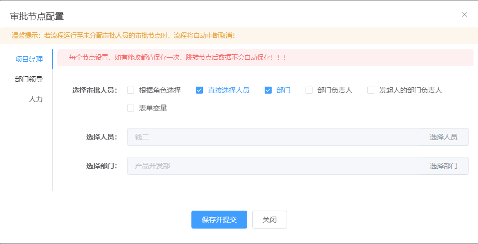

# 流程定义

## 一. 组件名称

- CubeProcessDefinition

## 二. 功能示例

### 1. 流程定义列表：


### 2. 节点配置：



## 三. 组件使用代码示例

```js
<CubeProcessDefinition
    @getDefinitionListCall="onGetDefinitionList"
    @delDefinitionCall="onDelDefinition"
    @suspendOrActiveDefinitionCall="onSuspendOrActiveDefinition"
    @getProcessImgCall="onGetProcessImg"
    @getNodeListCall="onGetNodeList"
    @getNodeConfigCall="onGetNodeConfig"
    @saveNodeConfigCall="onSaveCubeNodeConfig"
    @getDeptTreeCall="onGetDeptTree"
    @getUserListCall="onGetUserList"
    @getRoleListCall="onGetRoleList"
  >
</CubeProcessDefinition>
```

### 四、 组件方法

| 方法名称              | 实现函数              | 说明                  | 请求参数                  | 返回数据                  |
| ---------------------| --------------------| -------------------------| -------------------- |---------------------------|
| getDefinitionListCall     | onGetList        | 获取定义的流程列表        | {key : 流程 key, name : 流程名称, category : 所属分类，pageNum : 分页页数, pageSize : 每页数量}   | { "total":流程定义总数量, "rows":流程定义列表, "code":状态码, "msg":返回的信息 }     |
| delDefinitionCall     | onDelDefinition       | 删除定义的流程        | {processDefinitionId : 流程定义 id 数组, cascade : 是否级联删除 }   | { "msg":返回的信息, "code":状态码 }     |
| suspendOrActiveDefinitionCall     | onSuspendOrActiveDefinition       | 激活或者挂起定义好的流程        | {id : 流程 id, suspendState : 状态}     | { "msg":返回的信息, "code":状态码 }     |
| getProcessImgCall     | onGetProcessImg       | 获取流程图 xml         | {deploymentId : 部署 id,resourceName : 资源名称}  | { "msg":返回的信息, "code":状态码, "data":返回的数据 }     |
| getNodeListCall     | onGetNodeList        | 获取节点列表       | {procDefId: 流程定义id}   | { "msg":返回的信息, "code":状态码, "data":返回的数据 }     |
| getNodeConfigCall    | onGetNodeConfig      | 获取指定节点配置      | {procDefId: 流程定义id，nodeId: 节点id}   | { "msg":返回的信息, "code":状态码, "data":返回的数据 }     |
| saveNodeConfigCall     | onSaveCubeNodeConfig      | 保存节点配置        | [{ nodeId: 节点id,procDefId: 流程定义id,userType: 选中的用户类型,relateId: 关联id,}]   | { "msg":返回的信息, "code":状态码 }     |
| getDeptTreeCall     | onGetDeptTree      | 获取部门树       | 无    | { "msg":返回的信息, "code":状态码, "data":返回的数据 }     |
| getUserListCall     | onGetUserList       | 获取用户列表       |  {userName: 用户名,pageNum: 分页页数,pageSize: 分页大小,deptId:部门id} |  { "total":总数量, "rows":返回的数据, "code":状态码, "msg":返回的信息 }  |
| getRoleListCall     | onGetRoleList      | 获取角色列表  |{id: 角色编码,name: 角色名称,pageSize: 分页大小,pageNum: 分页页数} |  { "total":总数量, "rows":返回的数据, "code":状态码, "msg":返回的信息 }  |

## 五. 方法函数代码示例

### * 获取流程定义列表

```js
// 前端调用接口
onGetDefinitionList: (params, callback) => {
  request({
    url: "/process/definition/list",
    method: "post",
    data: params,
  }).then((response) => {
    callback(response);
  });
},
```

```java
// 后台示例：获取流程定义列表
@PostMapping("/list")
public TableDataInfo list(@RequestBody ProcessDefinitionDto processDefinitionDto){
  Integer pageNum = processDefinitionDto.getPageNum();
  Integer pageSize = processDefinitionDto.getPageSize();
  CubeProcessDefinition processDefinition = new CubeProcessDefinition();
  processDefinition.setCategory(processDefinitionDto.getCategory());
  processDefinition.setKey(processDefinitionDto.getKey());
  processDefinition.setName(processDefinitionDto.getName());
  List<CubeProcessDefinition> list = cubeProcessDefinitionService.listProcessDefinition(processDefinition,pageNum,pageSize);
  return getDataTable(list);
}
```
### * 删除流程定义
```js
// 前端调用接口示例
onDelDefinition: (params, callback) => {
  request({
    url: "/process/definition/delete",
    method: "post",
    data: params,
  }).then((response) => {
    callback(response);
  });
},
```

```java
// 后台示例
@PostMapping("/delete")
public AjaxResult delete(@RequestBody Map<String,Object> params){
  cubeProcessDefinitionService.delete((String) params.get("processDefinitionId"),(Boolean) params.get("cascade"));
  return AjaxResult.success();
}
```
### * 激活或者挂起流程定义
```js
// 前端调用接口示例
onSuspendOrActiveDefinition: (params, callback) => {
  request({
    url: "/process/definition/suspendOrActiveDefinition",
    method: "post",
    data: params,
  }).then((response) => {
    callback(response);
  });
},
```

```java
// 后台示例
@PostMapping("/suspendOrActiveDefinition")
public AjaxResult suspendOrActiveDefinition(@RequestBody Map<String,String> params){
  cubeProcessDefinitionService.suspendOrActiveDefinition(params.get("id"),params.get("suspendState"));
  return AjaxResult.success();
}
```
### * 获取流程图
```js
// 前端调用接口示例
onGetProcessImg: (params, callback) => {
  request({
    url: "/process/definition/getXml",
    method: "post",
    data: params,
  }).then((response) => {
    callback(response);
  });
},
```

```java
// 后台示例
@PostMapping("/getXml")
public AjaxResult getXml(@RequestBody Map<String,String> params){
  return AjaxResult.success(cubeProcessDefinitionService.getProcessXmlStr(params.get("deploymentId"),params.get("resourceName")));
}
```
### * 获取节点列表
```js
// 前端调用接口示例
onGetNodeList: (params, callback) => {
  request({
    url: "/process/definition/list/node",
    method: "post",
    data: params,
  }).then((response) => {
    callback(response);
  });
},
```

```java
// 后台示例
@PostMapping("/list/node")
public AjaxResult nodeList(@RequestBody Map<String,String> params){
  return AjaxResult.success(cubeProcessDefinitionService.getNodeList(params.get("procDefId")));
}
```
### * 获取节点配置
```js
// 前端调用接口示例
onGetNodeConfig: (params, callback) => {
  request({
    url: "/process/definition/node/config",
    method: "post",
    data: params,
  }).then((response) => {
    callback(response);
  });
},
```

```java
// 后台示例
@PostMapping("/node/config")
public AjaxResult getNodeConfig(@RequestBody Map<String,String> params){
  return AjaxResult.success(cubeNodeConfigService.getNodeConfigList(params.get("procDefId"),params.get("nodeId")));
}
```
### * 保存节点配置
```js
// 前端调用接口示例
onSaveCubeNodeConfig: (params, callback) => {
  request({
    url: "/process/definition/node/config/save",
    method: "post",
    data: params,
  }).then((response) => {
    callback(response);
  });
},
```

```java
// 后台示例
@PostMapping("/node/config/save")
public AjaxResult saveNodeConfig(@RequestBody List<CubeNodeConfig> list){
    LoginUser loginUser = getLoginUser();
    cubeNodeConfigService.updateNodeConfig(list,loginUser.getUsername());
    return AjaxResult.success();
}
```
### *  获取部门树
```js
// 前端调用接口示例
onGetDeptTree: (callback) => {
  request({
    url: "/deptTree",
    method: "post",
  }).then((response) => {
    callback(response);
  });
},
```

```java
// 后台示例
@PostMapping("/deptTree")
public AjaxResult getDeptTree(){
    return AjaxResult.success(cubeDeptService.selectDeptTree());
}
```
### * 获取用户列表
```js
// 前端调用接口示例
onGetUserList: (params, callback) => {
  request({
    url: "/list/user",
    method: "post",
    data: params,
  }).then((response) => {
    callback(response);
  });
},
```

```java
// 后台示例
@PostMapping("/list/user")
public TableDataInfo getUserList(@RequestBody Map<String,String> params){
  startPage();
  List<CubeUser> list = cubeUserService.selectUserList(params.get("userName"),params.get("deptId"));
  return getDataTable(list);
}
```
### * 获取角色列表
```js
// 前端调用接口示例
onGetRoleList: (params, callback) => {
  request({
    url: "/list/role",
    method: "post",
    data: params,
  }).then((response) => {
    callback(response);
  });
},
```

```java
// 后台示例
@PostMapping("/list/role")
public TableDataInfo getRoleList(@RequestBody CubeRole cubeRole){
    startPage();
    List<CubeRole> list = cubeUserService.getRoleList(cubeRole);
    return getDataTable(list);
}
```