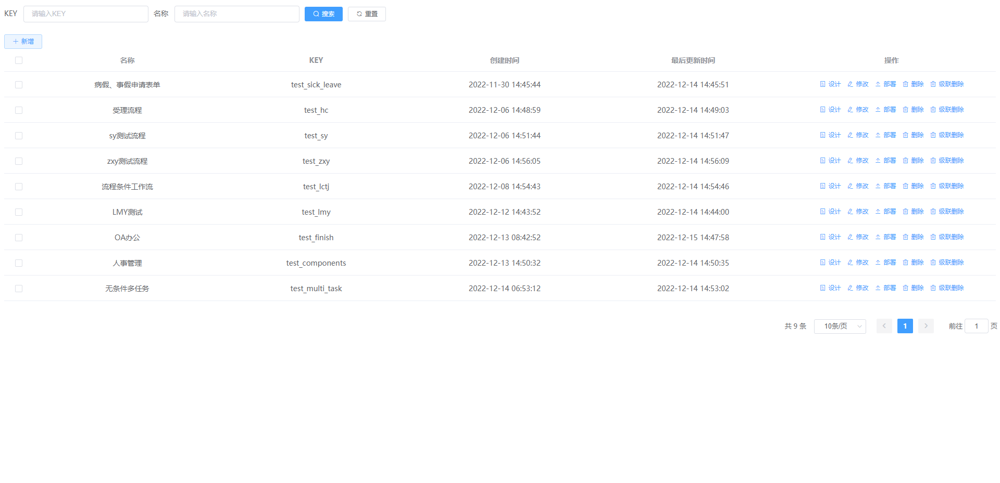
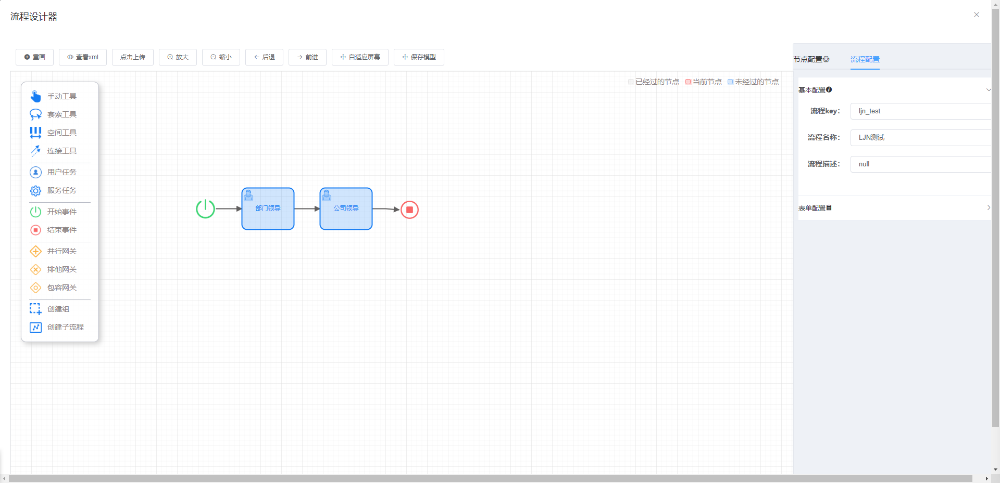

# 流程设计  

## 一. 组件名称

* CubeProcessDesign  

## 二. 功能示例 

### 1. 表单管理：
  

### 2. 流程设计：
  

## 三. 组件使用代码示例
```js
<CubeProcessDesign
    @getProcessListCall="onGetList"
    @getProcessCall="onGetProcess"
    @addProcessDesignCall="onAddDesign"
    @editProcessDesignCall="onEditDesign"
    @delProcessDesignCall="onDelDesign"
    @deployProcessDesignCall="onDeployDesign"
    @getProcessFormCall="onGetForm"
    @getProcessDesignCall="onProcessDesign"
    @saveModelerCall="onSaveModeler"
  >
</CubeProcessDesign>
```  
  
## 四. 组件方法  


| 方法名称              | 实现函数              | 说明                  | 参数                  | 返回数据                  |
| ---------------------| --------------------| ----------------------| -------------------- |---------------------------|
| @getProcessListCall     | onGetList        | 查询流程模型信息列表        | queryParams   | { "total":1, "rows":[], "code":200, "msg":"查询成功" }     |
| @getProcessCall     | onGetProcess       | 按照id获取流程模型信息        | modelId   | { "msg":"操作成功", "code":200, "data":{} }     |
| @addProcessDesignCall     | onAddDesign       | 新增设计模型        | formObject     | { "msg":"操作成功", "code":200, "data":{} }     |
| @editProcessDesignCall     | onEditDesign       | 保存设计模型        | formObject   | { "msg":"操作成功", "code":200, "data":{} }     |
| @delProcessDesignCall     | onDelDesign        | 删除设计模型       | modelId   | { "msg":"操作成功", "code":200, "data":{} }     |
| @deployProcessDesignCall    | onDeployDesign      | 部署设计模型      | modelId   | { "msg":"操作成功", "code":200, "data":{} }     |
| @getProcessFormCall     | onGetForm      | 获取可绑定表单        | queryFormParams   | { "total": 3, "rows": [], "code": 200, "msg": "查询成功" }     |
| @getProcessDesignCall     | onProcessDesign      | 获取流程设计       | modelId    | { "msg":"操作成功", "code":200, "data":{} }     |
| @saveModelerCall     | onSaveModeler       | 保存模型编辑器       | formObject  |   { "msg":"操作成功", "code":200, "data":{} }     |

## 五. 方法函数代码示例  

### * 获取流程列表
```js
// 前端调用接口
onGetList: (params, callback) => {
  onGetList: (queryParams, callback) => {
    // console.log(queryParams)
    // 根据参数ajax请求
    request({
      // 接口url
      url: '/flowable/processDesign/list',
      // 请求方式
      method: 'get',
      params: queryParams
    }).then(response => {
      callback(response)
    })
  },
}
```
```java
// 后台：获取流程列表
@GetMapping("/list")
//调用cubeFlowableModelerService.modelerLis方法获取流程列表
public TableDataInfo list(ProcessDesignDto processDesignDto) {
  startPage();
  Integer pageNum = processDesignDto.getPageNum();
  Integer pageSize = processDesignDto.getPageSize();
  ModelEntityImpl modelEntity = new ModelEntityImpl();
  modelEntity.setKey(processDesignDto.getKey());
  modelEntity.setName(processDesignDto.getName());
  // 调用modelerList方法获取流程信息列表
  CubePage list = cubeFlowableModelerService.modelerList(modelEntity, pageNum, pageSize);
  return getDataTable(list);
}
```

### * 根据流程模型id获取流程模型信息
```js
// 前端调用接口
onGetProcess: (modelId, callback) => {
  // console.log(modelId)
  // 根据参数ajax请求
  request({
    // 接口url
    url: '/flowable/processDesign/getModeler',
    // 请求方式
    method: 'get',
    params: {'modelId': modelId}
  }).then(response => {
    callback(response)
  })
},
```
```java
// 后台：根据流程模型id获取流程模型信息
@GetMapping(value = "/getModeler")
public AjaxResult getModeler(String modelId) {
  // 调用cubeFlowableModelerService.queryModelerById方法按照id获取流程模型信息
  return AjaxResult.success(cubeFlowableModelerService.queryModelerById(modelId));
}
```

### * 创建流程模型
```js
// 前端调用接口
onAddDesign: (formObject, callback) => {
  // console.log(formObject)
  // 根据参数ajax请求
  request({
    url: '/flowable/processDesign/create',
    method: 'post',
    data: formObject
  }).then(response => {
    callback(response)
  })
},
```
```java
@PostMapping(value = "/create")
public AjaxResult create(@RequestBody ProcessDesignDto processDesignDto) {
  // 调用cubeFlowableModelerService.createModeler方法新建流程
  return AjaxResult.success(cubeFlowableModelerService.createModeler(processDesignDto.getKey(),
          processDesignDto.getName(),
          processDesignDto.getFormId(),
          processDesignDto.getCategory(),
          processDesignDto.getDescription()));
}
```

### * 修改流程模型
```js
// 前端调用接口
onEditDesign: (formObject, callback) => {
  // console.log(formObject)
  // 根据参数ajax请求
  request({
    url: '/flowable/processDesign/update',
    method: 'post',
    data: formObject
  }).then(response => {
    callback(response)
  })
},
```
```java
@PostMapping(value = "/update")
public AjaxResult update(@RequestBody ModelRequest modelRequest) {
  // 调用cubeFlowableModelerService.updateModeler方法修改流程信息
  cubeFlowableModelerService.updateModeler(modelRequest);
  return AjaxResult.success();
}
```

### * 删除流程模型
```js
// 前端调用接口
onDelDesign: (modelId, cascade, callback) => {
  // console.log(modelId, cascade)
  // 根据参数ajax请求
  request({
    url: '/flowable/processDesign/remove',
    method: 'get',
    params: {'modelId': modelId, "cascade": cascade}
  }).then(response => {
    callback(response.data)
  })
},
```
```java
@GetMapping("/remove")
public AjaxResult remove(String modelId, boolean cascade) {
  // 调用cubeFlowableModelerService.deleteModeler方法删除流程信息
  cubeFlowableModelerService.deleteModeler(modelId, cascade);
  return AjaxResult.success();
}
```

### * 部署流程模型
```js
// 前端调用接口
onDeployDesign: (modelId, callback) => {
  // console.log(modelId)
  // 根据参数ajax请求
  request({
    url: '/flowable/processDesign/deploy',
    method: 'post',
    params: {'modelId': modelId}
  }).then(response => {
    callback(response.data)
  })
},
```
```java
@PostMapping(value = "/deploy")
public AjaxResult deployModel(String modelId) {
  // 调用cubeFlowableModelerService.deployModeler方法部署流程模型
  cubeFlowableModelerService.deployModeler(modelId);
  return AjaxResult.success();
}
```

### * 获取弹窗内绑定表单列表
```js
// 前端调用接口
onGetForm: (queryFormParams, callback) => {
  // console.log(queryFormParams)
  // 根据参数ajax请求
  request({
    url: '/flowable/formDesign/list',
    method: 'get',
    params: queryFormParams
  }).then(response => {
    console.log(response)
    callback(response)
  })
}
```
```java
@GetMapping("/list")
public TableDataInfo list(CubeFlowForm cubeFlowForm) {
  startPage();
  // 调用cubeFlowFormService.selectList方法获取表单列表
  List<CubeFlowForm> list = cubeFlowFormService.selectList(cubeFlowForm);
  return getDataTable(list);
}
```

### * 打开流程设计图信息
```js
// 前端调用接口
onProcessDesign: (modelId, callback) => {
// console.log(modelId)
request({
  url: '/flowable/processDesign/queryModelerById',
  method: 'get',
  params: {'modelId': modelId}
  }).then(response => {
    console.log(response)
    callback(response)
  })
},
```
```java
@GetMapping(value = "/queryModelerById")
public AjaxResult queryModelerById(String modelId) {
  // 调用cubeFlowableModelerService.queryModelerById方法获取流程设计图信息
  return AjaxResult.success(cubeFlowableModelerService.queryModelerById(modelId));
}
```

### * 保存流程设计器
```js
onSaveModeler: (modelRequest, callback) => {
  // console.log(modelRequest);
  // 根据参数ajax请求
  request({
    url: '/flowable/processDesign/saveModelEditor',
    method: 'post',
    data: modelRequest
  }).then(response => {
    callback(response)
  })
},
```
```java
@PostMapping(value = "/saveModelEditor")
public AjaxResult saveModelEditor(@RequestBody ModelRequest modelRequest) {
  // 调用cubeFlowableModelerService.saveModelEditor方法保存流程设计器
  cubeFlowableModelerService.saveModelEditor(modelRequest);
  return AjaxResult.success();
}
```
