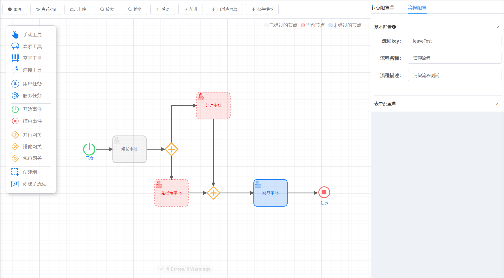
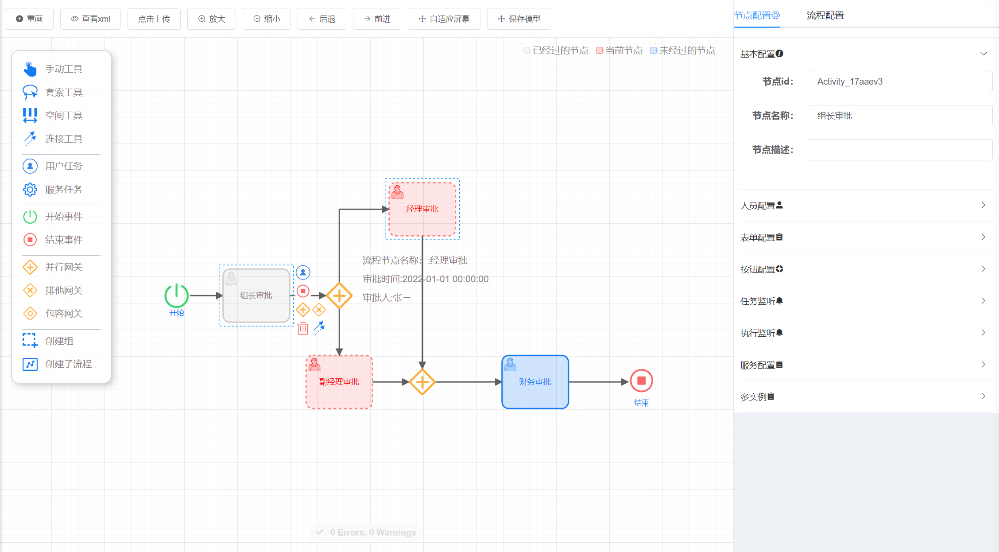

# 流程设计器  

## 一. 组件名称

* CubeBpmn  

## 二. 功能示例 

### 1. 表单管理
  

### 2. 表单设计
  

## 三. 组件使用代码示例
```js
<cube-bpmn
  :xml="designBpmnObj.editor"
  form-size="small"
  :form-property="formProperty"
  :form-key="formKey"
  :show-dialog="true"
  :is-view="false"
  :modelObject="designBpmnObj"
  @saveModelerCall="saveModeler"
/>
```  
  
## 四. 组件方法  


| 参数         | 说明                                                                     | 类型    | 可选值                | 默认值 |
| ------------ | ------------------------------------------------------------------------ | ------- | --------------------- | ------ |
| xml          | 标准的BPMN格式，用于加载流程图                                           | string  | --                    | null   |
| formSize     | 表单大小，参考element                                                    | string  | medium / small / mini | mini   |
| formProperty | 表单属性，参考下面表单属性                                               | Array   | --                    | --     |
| formKey      | 表单key，用于选择表单，参考表单属性                                      | String  | --                    | --     |
| showDialog   | 移动到节点上时，是否显示dialog                                           | boolean | false/true            | false  |
| isView       | 是否显示编辑功能                                                         | boolean | false/true            | true   |
| completeList | 流程完成节点样式，节点id数组                                             | Array   | --                    | --     |
| todoList     | 流程当前节点样式，节点id数组                                             | Array   | --                    | --     |
| formDetail   | 流程表单处理信息，移动到节点上时，显示dialog的内容，showDialog必须为true | --      | --                    |
| modelObject   | 流程对象基本信息 | Object      | --                    |
| @saveModelerCall   | 保存模型数据回调函数 | Object      | --                    |


### 表单属性
| 参数     | 说明                                                  | 类型   | 可选值                                                                                            |
| -------- | ----------------------------------------------------- | ------ | ------------------------------------------------------------------------------------------------- |
| id       | 表单唯一值，用于判断加载哪个表单，配置formKey属性使用 | string | 必填                                                                                              |
| name     | 表单名称                                              | string | 必填                                                                                              |
| property | 表单填写信息                                          | Array  | {id: '字段id', name: '字段名称', readable: 是否可读(true/false), writable: 是否可写(true/false) } |

## 五. 方法函数代码示例  

### 表单设计列表
```js
// 保存模型编辑器
onSaveModeler: (modelRequest, callback) => {
  // 根据参数ajax请求
  request({
    url: '/flowable/processDesign/saveModelEditor',
    method: 'post',
    data: modelRequest
  }).then(response => {
    callback(response)
  })
},
```
```java
// 后台controller
/**
  * 保存模型编辑器
  * @param modelRequest 模型对象
  */
@PostMapping(value = "/saveModelEditor")
public AjaxResult saveModelEditor(@RequestBody ModelRequest modelRequest) {
    // 调用工作流引擎的cubeFlowableModelerService.saveModelEditor方法保存模型编辑器
    cubeFlowableModelerService.saveModelEditor(modelRequest);
    return AjaxResult.success();
}
```
