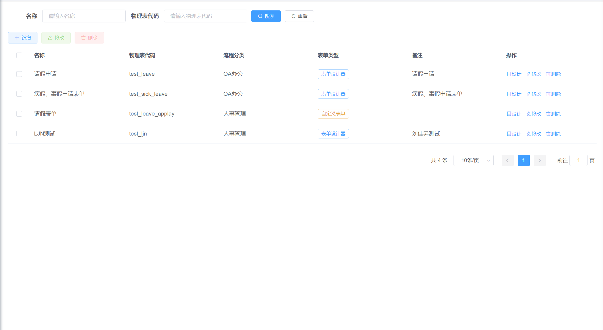
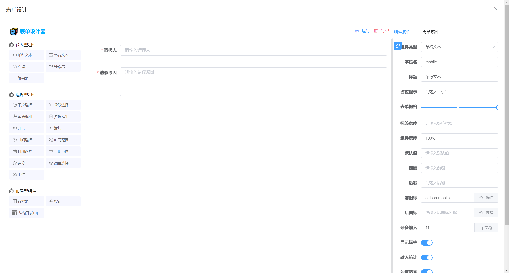

# 表单设计  

## 一. 组件名称

* CubeFormDesign  

## 二. 功能示例 

### 1. 表单管理
  

### 2. 表单设计
  

## 三. 组件使用代码示例
```js
<cube-form-design
    :categoryOptions="categoryOpts"
    @getListCall="onGetList"
    @getFormCall="onGetForm"
    @addFormCall="onAddForm"
    @updateFormCall="onUpdateForm"
    @delFormCall="onDelForm"
    @saveDesignCall="onSaveDesign">
  </cube-form-design>
```  
  
## 四. 组件方法  


| 方法名称               | 说明                    | 参数                |  返回数据
| ----------------------| ------------------------| ---------------------------------- |---------------------------|
| @getListCall        | 表单设计列表回调函数        | queryParams   |  {"total":4,"rows":[],"code":200,"msg":"查询成功"}  |
| @getFormCall       | 按照id获取表单设计信息回调函数        | id   | {"msg":"操作成功","code":200,"data":{}} |
| @addFormCall       | 新增表单设计回调函数        | formObject     | {"msg":"操作成功","code":200,"data":{}} |
| @updateFormCall    | 修改表单设计回调函数        | formObject   |  {"msg":"操作成功","code":200,"data":{}} |
| @delFormCall        | 删除表单设计回调函数       | ids   |  {"msg":"操作成功","code":200,"data":{}} |
| @saveDesignCall      | 保存设计的表单模型回调函数      | formObject   | {"msg":"操作成功","code":200,"data":{}} |
| :categoryOptions      | 传入的分类参数回调函数        | [{"id":16,"label":"人事管理"},{"id":17,"label":"OA办公"}]   |

## 五. 方法函数代码示例  

### 表单设计列表
```js
// 实现表单设计列表回调函数的前端调用接口
onGetList: (queryParams, callback) => {
  // 根据参数ajax请求
  request({
    url: '/flowable/formDesign/list',
    method: 'get',
    params: queryParams
  }).then(response => {
    callback(response)
  })
}
```
```java
// 后台controller
/**
  * 查询列表
  * @param cubeFlowForm
  * @return
  */
@GetMapping("/list")
public TableDataInfo list(CubeFlowForm cubeFlowForm) {
    startPage();
    // 调用工作流引擎的cubeFlowFormService.selectList方法查询表单设计列表
    List<CubeFlowForm> list = cubeFlowFormService.selectList(cubeFlowForm);
    return getDataTable(list);
}
```

### 根据表单设计id获取表单设计信息
```js
// 实现按照id获取表单设计信息回调函数的前端调用接口
onGetForm: (id, callback) => {
  // 根据参数ajax请求
  request({
    url: '/flowable/formDesign/getForm',
    method: 'get',
    params: {'id': id}
  }).then(response => {
    callback(response.data)
  })

},
```
```java
// 后台controller
/**
  * 通过id获取表单设计对象
  * @param id
  * @return
  */
@GetMapping("/getForm")
public AjaxResult getForm(Long id) {
    // 调用工作流引擎的cubeFlowFormService.selectFormById方法获取表单设计对象
    return AjaxResult.success(cubeFlowFormService.selectFormById(id));
}
```

### 新增表单设计
```js
// 实现新增表单设计回调函数的前端调用接口
onAddForm: (formObject, callback) => {
  // 根据参数ajax请求
  request({
    url: '/flowable/formDesign/add',
    method: 'post',
    data: formObject
  }).then(response => {
    callback(response)
  })

}
```
```java
// 后台controller
/**
  * 新增表单设计
  * @param cubeFlowForm
  * @return
  */
@PostMapping("/add")
public AjaxResult add(@RequestBody CubeFlowForm cubeFlowForm) {
    // 获取业务系统当前登陆人并传给流程引擎
    LoginUser loginUser = getLoginUser();
    CurrentUser user = new CurrentUser();
    user.setId(loginUser.getUserId());
    user.setUserName(loginUser.getUsername());
    cubeFlowForm.setCurrentUser(user);
    // 调用工作流引擎的cubeFlowFormService.insertWfForm方法新增
    return AjaxResult.success(cubeFlowFormService.insertWfForm(cubeFlowForm));
}
```

### 修改表单设计
```js
// 实现修改表单设计回调函数的前端调用接口
onUpdateForm: (formObject, callback) => {
  // 根据参数ajax请求
  request({
    url: '/flowable/formDesign/edit',
    method: 'post',
    data: formObject
  }).then(response => {
    callback(response)
  })
}
```
```java
// 后台controller
/**
  * 修改表单设计
  * @param cubeFlowForm
  * @return
  */
@PostMapping("/edit")
public AjaxResult edit(@RequestBody CubeFlowForm cubeFlowForm) {
    // 获取业务系统当前登陆人并传给流程引擎
    LoginUser loginUser = getLoginUser();
    CurrentUser user = new CurrentUser();
    user.setId(loginUser.getUserId());
    user.setUserName(loginUser.getUsername());
    cubeFlowForm.setCurrentUser(user);
    // 调用工作流引擎的cubeFlowFormService.updateWfForm方法修改
    return AjaxResult.success(cubeFlowFormService.updateWfForm(cubeFlowForm));
}
```

### 删除表单设计
```js
// 实现删除表单设计回调函数的前端调用接口
onDelForm: (ids, callback) => {
  // 根据参数ajax请求
  request({
    url: '/flowable/formDesign/delete',
    method: 'get',
    params: {'ids': ids}
  }).then(response => {
    callback(response.data)
  })
}
```
```java
// 后台controller
/**
  * 删除表单设计
  * @param ids
  * @return
  */
@GetMapping("/delete")
public AjaxResult delete(Long[] ids) {
  // 调用工作流引擎的cubeFlowFormService.deleteWfFormByIds方法删除
    return AjaxResult.success(cubeFlowFormService.deleteWfFormByIds(ids));
}
```

### 保存表单模型设计
```js
// 实现保存设计的表单模型回调函数的前端调用接口
onSaveDesign: (formObject, callback) => {
  // 根据参数ajax请求
  request({
    url: '/flowable/formDesign/saveFormDesign',
    method: 'post',
    data: formObject
  }).then(response => {
    callback(response)
  })
}
```
```java
// 后台controller
/**
  * 保存设计
  * @param cubeFlowForm
  * @return
  * @throws Exception
  */
@PostMapping("/saveFormDesign")
public AjaxResult saveFormDesign(@RequestBody CubeFlowForm cubeFlowForm) throws Exception {
    // 获取业务系统当前登陆人并传给流程引擎
    LoginUser loginUser = getLoginUser();
    CurrentUser user = new CurrentUser();
    user.setId(loginUser.getUserId());
    user.setUserName(loginUser.getUsername());
    cubeFlowForm.setCurrentUser(user);
    // 调用工作流引擎的cubeFlowFormService.saveFormDesign方法保存表单模型设计
    return AjaxResult.success(cubeFlowFormService.saveFormDesign(cubeFlowForm, "cube-ruoyi"));
}
```

## 六. 完整调用代码示例  
### 前端vue页面代码
```js
<template>
  <cube-form-design
    :categoryOptions="categoryOpts"
    @getListCall="onGetList"
    @getFormCall="onGetForm"
    @addFormCall="onAddForm"
    @updateFormCall="onUpdateForm"
    @delFormCall="onDelForm"
    @saveDesignCall="onSaveDesign">
  </cube-form-design>
</template>

<script>

import request from '@/utils/request'

export default {
  data() {
    return {
      categoryOpts: [{"id":16,"label":"人事管理"},{"id":17,"label":"OA办公"},{"id":19,"label":"测试0316-001"},{"id":20,"label":"受理流程"}]
    }
  },
  methods: {
    onGetList: (queryParams, callback) => {
      
      // 根据参数ajax请求
      console.log(queryParams)

      request({
        url: '/flowable/formDesign/list',
        method: 'get',
        params: queryParams
      }).then(response => {
        console.log(response)
        callback(response)
      })
      
    },
    onGetForm: (id, callback) => {
      // 根据参数ajax请求
      console.log(id)
      request({
        url: '/flowable/formDesign/getForm',
        method: 'get',
        params: {'id': id}
      }).then(response => {
        callback(response.data)
      })

    },
    onAddForm: (formObject, callback) => {
      // 根据参数ajax请求
      console.log(formObject)
      request({
        url: '/flowable/formDesign/add',
        method: 'post',
        data: formObject
      }).then(response => {
        callback(response)
      })

    },
    onUpdateForm: (formObject, callback) => {
      // 根据参数ajax请求
      console.log(formObject)

      request({
        url: '/flowable/formDesign/edit',
        method: 'post',
        data: formObject
      }).then(response => {
        callback(response)
      })
    },
    onDelForm: (ids, callback) => {
      // 根据参数ajax请求
      console.log(ids)

      request({
        url: '/flowable/formDesign/delete',
        method: 'get',
        params: {'ids': ids}
      }).then(response => {
        callback(response.data)
      })
    },
    onSaveDesign: (formObject, callback) => {
      // 根据参数ajax请求
      console.log(formObject)

      request({
        url: '/flowable/formDesign/saveFormDesign',
        method: 'post',
        data: formObject
      }).then(response => {
        callback(response)
      })
    }
  }
}
</script>

<style>

</style>
```
### 后端java代码
```java
package com.ruoyi.web.controller.flowable;

import com.liujianan.cube.flowable.common.core.web.domain.CurrentUser;
import com.liujianan.cube.flowable.entity.CubeFlowForm;
import com.liujianan.cube.flowable.service.CubeFlowFormService;
import com.ruoyi.common.core.controller.BaseController;
import com.ruoyi.common.core.domain.AjaxResult;
import com.ruoyi.common.core.domain.model.LoginUser;
import com.ruoyi.common.core.page.TableDataInfo;
import org.springframework.beans.factory.annotation.Autowired;
import org.springframework.web.bind.annotation.GetMapping;
import org.springframework.web.bind.annotation.PostMapping;
import org.springframework.web.bind.annotation.RequestBody;
import org.springframework.web.bind.annotation.RequestMapping;
import org.springframework.web.bind.annotation.RestController;

import java.util.List;

/**
 * @version v1.0
 * @ProjectName: RuoYi-Vue
 * @ClassName: FormDesignController
 * @Description: TODO(一句话描述该类的功能)
 * @Author: 风清扬 [刘佳男]
 * @Date: 2022/11/21 9:37
 */

@RestController
@RequestMapping("/flowable/formDesign")
public class FormDesignController extends BaseController {

    @Autowired
    private CubeFlowFormService cubeFlowFormService;

    /**
     * 查询列表
     * @param cubeFlowForm
     * @return
     */
    @GetMapping("/list")
    public TableDataInfo list(CubeFlowForm cubeFlowForm) {
        startPage();
        List<CubeFlowForm> list = cubeFlowFormService.selectList(cubeFlowForm);
        return getDataTable(list);
    }

    /**
     * 通过id获取表单设计对象
     * @param id
     * @return
     */
    @GetMapping("/getForm")
    public AjaxResult getForm(Long id) {
        return AjaxResult.success(cubeFlowFormService.selectFormById(id));
    }

    /**
     * 新增表单设计
     * @param cubeFlowForm
     * @return
     */
    @PostMapping("/add")
    public AjaxResult add(@RequestBody CubeFlowForm cubeFlowForm) {
        // 获取业务系统当前登陆人并传给流程引擎
        LoginUser loginUser = getLoginUser();
        CurrentUser user = new CurrentUser();
        user.setId(loginUser.getUserId());
        user.setUserName(loginUser.getUsername());
        cubeFlowForm.setCurrentUser(user);
        return AjaxResult.success(cubeFlowFormService.insertWfForm(cubeFlowForm));
    }

    /**
     * 修改表单设计
     * @param cubeFlowForm
     * @return
     */
    @PostMapping("/edit")
    public AjaxResult edit(@RequestBody CubeFlowForm cubeFlowForm) {
        // 获取业务系统当前登陆人并传给流程引擎
        LoginUser loginUser = getLoginUser();
        CurrentUser user = new CurrentUser();
        user.setId(loginUser.getUserId());
        user.setUserName(loginUser.getUsername());
        cubeFlowForm.setCurrentUser(user);
        return AjaxResult.success(cubeFlowFormService.updateWfForm(cubeFlowForm));
    }

    /**
     * 删除表单设计
     * @param ids
     * @return
     */
    @GetMapping("/delete")
    public AjaxResult delete(Long[] ids) {
        return AjaxResult.success(cubeFlowFormService.deleteWfFormByIds(ids));
    }

    /**
     * 保存设计
     * @param cubeFlowForm
     * @return
     * @throws Exception
     */
    @PostMapping("/saveFormDesign")
    public AjaxResult saveFormDesign(@RequestBody CubeFlowForm cubeFlowForm) throws Exception {
        // 获取业务系统当前登陆人并传给流程引擎
        LoginUser loginUser = getLoginUser();
        CurrentUser user = new CurrentUser();
        user.setId(loginUser.getUserId());
        user.setUserName(loginUser.getUsername());
        cubeFlowForm.setCurrentUser(user);
        return AjaxResult.success(cubeFlowFormService.saveFormDesign(cubeFlowForm, "cube-ruoyi"));
    }
}

```